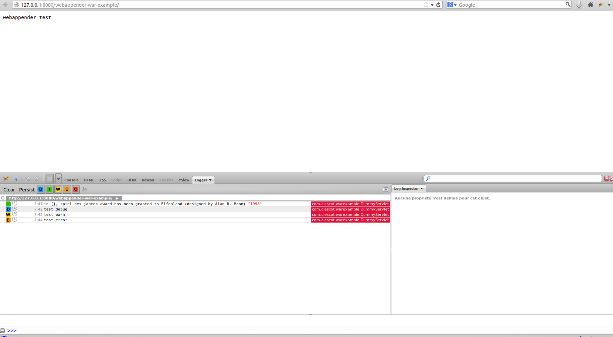
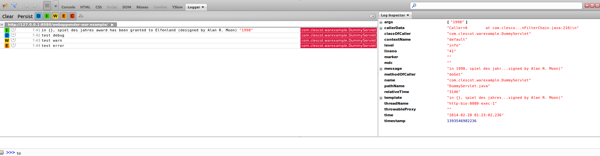

# Webappender

## Goal

webappender allow you to visualize the remote [logback](http://logback.qos.ch) logs, mapped only to your HTTP request, directly in your browser.


## Features

### Install the webappender library in your webapp

webappender support actually, [JEE](http://en.wikipedia.org/wiki/Java_Platform,_Enterprise_Edition) webapps which use the [logback](http://logback.qos.ch) library.

1. You have to add to your pom.xml this dependency :
   
	```xml
	<dependency>
	  <groupId>com.clescot</groupId>
	    <artifactId>webappender</artifactId>
	    <version>1.3</version>
	</dependency>
	```

	A ServletFilter installed via annotation is shipped with the library. Its *urlPatterns* maps to all requests (`/*`).

2. Activate the webappender

	By default, webappender is **disabled** .

	**Permit to Visualize logs to anyone can be very risky and dangerous in production environments**.

	So, to prevent any configuration error, we disable by default the webappender.
	To activate it, you have to put this parameter on the command line launching your application server :
	`-Dwebappender=true`.


 
### What kind of logs i can visualize ?

webappender, output only logs generated by the thread of **your request**. It permits to diagnose easily some unit problems,
and avoid any interwoven hell from multiple simultaneously requests.

Based on logback, webappender output these informations : 

* message
* template
* template arguments
* level
* timestamp
* relativeTime
* threadName
* classOfCaller
* methodOfCaller
* [Mapped Diagnostic Context](http://logback.qos.ch/manual/mdc.html)
* throwable proxy
* contextName
* callerData
* marker

### visualize your logback logs into your firefox browser

when the webappender is shipped in your webapp, and your application server is up, you have to install [the fireLogger plugin](https://addons.mozilla.org/en-us/firefox/addon/firelogger/).

When it's done, hit the F12 key, to visualise the firebug panel ;  you should see a new logger panel. It will highlight your logs, according to the level.
Logs are transmitted to your browser, when requests contains a special header forged by the FireLogger plugin  : `X-FireLogger`.

### Visualize your logback logs into your chrome browser

when the webappender is shipped in your webapp, and your application server is up, you have to [install](https://chrome.google.com/webstore/detail/chrome-logger/noaneddfkdjfnfdakjjmocngnfkfehhd) [the chrome logger plugin](http://craig.is/writing/chrome-logger).

When it's done, hit the F12 key, to visualise the **console** panel. It will highlight your logs, when you navigate on your webapp.
Logs are transmitted to your browser, when requests contains a special header  : `X-ChromeLogger`.
Unfortunately, Chrome logger does not transmit any custom header.
To fix it, you can install another extension like [`Modify Headers`](https://chrome.google.com/webstore/detail/modify-headers-for-google/innpjfdalfhpcoinfnehdnbkglpmogdi).

### Visualize your logback logs into any browser

If you cannot install any firefox or chrome plugin, or if you haven't any of these browsers, you can use a **body formatter**.

You have to :

- transmit to the server a special header  : `X-BodyLogger`, via an extension like *modify headers* (chrome or firefox), or any other one compatible with your browser.
- install at the start of your JSP, the taglib declaration, and at the end of your JSP files, the webappender tag . 
  If you use a templating library (like sitemesh for example), an unique insertion into a global decorator can do the job.
 

 ```xml
 <%@ page contentType="text/html;charset=UTF-8" language="java" %>
 <%@ taglib prefix="debug" uri="https://github.com/clescot/webappender-tag"%>
 
 <html>
 <head>
     <title>hello from test.jsp page</title>
 </head>
 <body>
 test.jsp
 </body>
 </html>
 <debug:webappender/>
 ```

Advantages of this method :
- there are no small size limitations (2Gb seems to be the limit)
  a chunked response may remove this limitation, but who will have a 2Gb of logs for one request ?
- it works on any browser

Drawbacks of this methods :
- it modifies your body response
- there are no pretty output for these logs
- you cannot filter on the browser-side your logs


### Tune log output

Webappender permits to tune the log output, via some specific request headers.
All of them start with the `X-wa` prefix, to explain that this option is non standard (*X*), and specific to the webappender (*wa*). 
If you use firefox, we recommend the [modify headers plugin](https://addons.mozilla.org/en-US/firefox/addon/modify-headers/).

#### Reduce log verbosity

webappender, permits to reduce the verbosity level, to :

1. lower the response header overhead 
2. inactivate time consuming logback display options

To reduce the log verbosity across all browsers, you have to put in your request these header key and value : 

`X-wa-verbose-logs=false`.

This option will **not output** these *expensive* log parts (which comes from converters in logback) : 

* lineNumber
* pathName
* time
* relativeTime
* threadName
* classOfCaller
* methodOfCaller
* MDC
* throwableProxy
* contextName
* callerData
* marker


#### Filtering logs

webappender, which actually support logback, support some [logback filters](http://logback.qos.ch/manual/filters.html), to reduce logs output.
Note that these filters are applied only to the output of the HTTP response, and maps only to logs tied to the request.
Logs are not filtered at start (there are not [turboFilters](http://logback.qos.ch/apidocs/ch/qos/logback/classic/turbo/class-use/TurboFilter.html), and appenders configured via the classic way (`logback.xml`), view all logs. 

##### Reduce logs with a threshold filter

Logback permits to add a [threshold filter](http://logback.qos.ch/manual/filters.html#thresholdFilter), to avoid too many noise in logs.
All logs from a too detailed level will not be output in the webappender.
This filter can be put in place with this kind of header : 
`X-wa-threshold-filter=INFO` 

##### Reduce logs with a level filter
Logback permits to add some [level filter](http://logback.qos.ch/manual/filters.html#levelFilter).

one filter configuration: 
`X-wa-level-filter=LEVEL:WARN;MATCH:ACCEPT;MISMATCH:NEUTRAL` 

two filters configuration :
`X-wa-level-filter=LEVEL:WARN;MATCH:ACCEPT;MISMATCH:NEUTRAL,X-wa-level-filter=LEVEL:DEBUG;MATCH:ACCEPT;MISMATCH:DENY`

##### Reduce logs with a headers size limit

you can add the header 'x-wa-limit-headers-size', with a numeric value, to limit the size of the serialized logs.
It will limit the size of the content serialized, before  the base64 encoding phase (i.e, the size specified can be 33% lower than the real size serialized).
This header only works, on ChromeLogger. 
It means, that if you encounter a too large serialization, which cause an error on the server, and you cannot raise up the limit explained further in this document, you have to put a value lower than your server limit. 

##### Customize logs with an EvaluatorFilter and a JaninoEventEvaluator
Logback permits to add some [EvaluatorFilter](http://logback.qos.ch/manual/filters.html#evalutatorFilter).
webappender support an EvaluatorFilter bounded with a [JaninoEventEvaluator] (http://logback.qos.ch/manual/filters.html#JaninoEventEvaluator).
To use it, add this custom header :
`X-wa-janino-filter=<MATCH/MISMATCH>:<ACCEPT/NEUTRAL/DENY>;expression:your custom expression`

For example, you can add this custom header with this related expresion to display only message containing the "3" character :
`X-wa-janino-filter=MATCH:ACCEPT;MISMATCH:DENY;expression:return formattedMessage.contains("3")`

You also need to add the janino dependency in your pom.xml file :

```xml
	<dependency>
	  <groupId>org.codehaus.janino</groupId>
	    <artifactId>janino</artifactId>
	    <version>2.6.1</version>
	</dependency>
	
```

More informations on custom expressions in the [JaninoEventEvaluator logback documentation] (http://logback.qos.ch/manual/filters.html#JaninoEventEvaluator)).

## Test quickly the demo webapp

You can test our super simple demo webapp, to illustrate the features of the webappender library.

### Prerequisites of the test

* [git](http://git-scm.com/) client.
* [java 7](http://www.oracle.com/technetwork/java/javase/downloads/index.html)
* [maven 3](http://maven.apache.org) or
higher
* [firefox](http://www.mozilla.org/fr/firefox/new/), need to be installed.
* [firebug](https://addons.mozilla.org/fr/firefox/addon/firebug/)
* [firelogger](https://addons.mozilla.org/firefox/addon/firelogger) addon.


### Install the demo
Follow these instructions in your terminal :

    git clone git@github.com:clescot/webappender.git
    cd webappender/webappender-war-example
    mvn org.apache.tomcat.maven:tomcat7-maven-plugin:2.2:run-war -Dwebappender=true


### Test in your browser

Launch your firefox browser, hit the F12 touch to activate firebug, and click on the *logger* tab.
 Go to [the webapp demo url](http://127.0.0.1:8080/webappender-war-example), and inspect the logger tab.

 You will see logs of the demo webapp :

 


### Test the consoleFormatter in your browser

Go to [the webapp demo url](http://127.0.0.1:8080/webappender-war-example/test), and inspect the console tab (hit F12).

### Additional informations

 Note the additional informations provided on the right panel! when you right-click on a row to display the DOM tab : 

 


## Potential issues

If serialized logs are important, you can be faced to two limitations :
  * server-side headers limitation
  * client-side headers limitation

### server-side headers limitation

If logs from your request are huge, your server can throw an exception.
To avoid this limit, you can configure your server.

#### Tomcat

For Tomcat, you can configure your container [your HTTP connector](http://tomcat.apache.org/tomcat-7.0-doc/config/http.html) with these parameters :

* **maxHeaderCount** *"The maximum number of headers in a request that are allowed by the container. A request that contains more headers than the specified limit will be rejected.
  A value of less than 0 means no limit. If not specified, a default of 100 is used."*
* **maxHttpHeaderSize** *"The maximum size of the request and response HTTP header, specified in bytes. If not specified, this attribute is set to 8192 (8 KB)."*

#### Jetty

For Jetty, you can configure your container [your HTTP connector](http://wiki.eclipse.org/Jetty/Howto/Configure_Connectors) with these parameters :

* **responseHeaderSize** *"Sets the size of the buffer for response headers. Default is 6K."*

### client-side headers limitation

Browsers has got some limitations on HTTP headers.

[According to a StackOverflowTopic](http://stackoverflow.com/questions/3326210/can-http-headers-be-too-big-for-browsers) :

 * Chrome browser header limit is 250 kb, and 256 kb for all headers.
 Chrome Logger extension reading logs in only one header, we are limited to 256 Kb.

 * firefox browser header limit is 10 kb, and 100 Mb or more for all headers.
 Firelogger extension reading logs in multiple headers, we have no limitations from it.

To overcome these limitations, you can configure some filters to serialize only useful logs from your requests.
